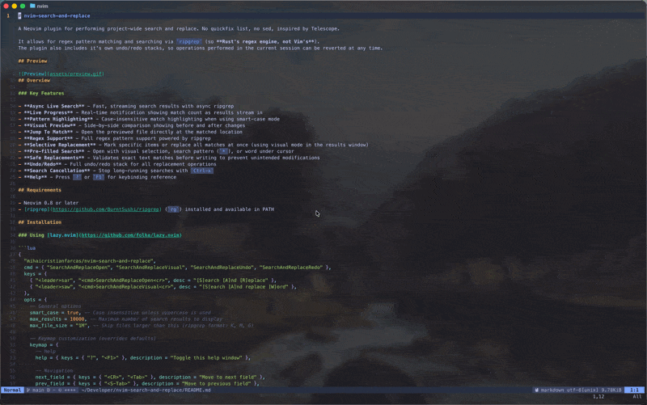

# nvim-search-and-replace

A Neovim plugin for performing project-wide search and replace. No quickfix list, no sed, inspired by Telescope.

It allows for regex pattern matching and searching via `ripgrep` (so **Rust's regex engine, not Vim's**). 
The plugin also includes it's own undo/redo stacks, so operations performed in the current session can be reverted at any time.

## Preview


## Overview

### Key Features

- **Async Live Search** - Fast, streaming search results with async ripgrep
- **Live Progress** - Real-time notification showing match count as results stream in
- **Pattern Highlighting** - Case-insensitive match highlighting when using smart-case mode
- **Visual Preview** - Side-by-side comparison showing before and after changes
- **Jump To Match** - Open the previewed file directly at the matched location
- **Regex Support** - Full regex pattern support powered by ripgrep
- **Selective Replacement** - Mark specific items or replace all matches at once (using visual mode in the results window)
- **Pre-filled Search** - Open with visual selection, search pattern (`*`), or word under cursor
- **Safe Replacements** - Validates exact text matches before writing to prevent unintended modifications
- **Undo/Redo** - Full undo/redo stack for all replacement operations
- **Search Cancellation** - Stop long-running searches with `Ctrl-x`
- **Help** - Press `?` or `F1` for keybinding reference

## Requirements

- Neovim 0.8 or later
- [ripgrep](https://github.com/BurntSushi/ripgrep) (`rg`) installed and available in PATH

## Installation

### Using [lazy.nvim](https://github.com/folke/lazy.nvim)

```lua
{
  "mihaicristianfarcas/nvim-search-and-replace",
  cmd = { "SearchAndReplaceOpen", "SearchAndReplaceVisual", "SearchAndReplaceUndo", "SearchAndReplaceRedo" },
  keys = {
    { "<leader>sar", "<cmd>SearchAndReplaceOpen<cr>", desc = "[S]earch [A]nd [R]eplace" },
    { "<leader>saw", "<cmd>SearchAndReplaceVisual<cr>", desc = "[S]earch [A]nd replace [W]ord" },
  },
  opts = {
    -- General options
    smart_case = true, -- Case insensitive unless uppercase is used
    max_results = 10000, -- Maximum number of search results to display
    max_file_size = "1M", -- Skip files larger than this (ripgrep format: K, M, G)
    
    -- Keymap customization (overrides defaults)
    keymap = {
      -- Help
      help = { keys = { "?", "<F1>" }, description = "Toggle this help window" },
      
      -- Navigation
      next_field = { keys = { "<CR>", "<Tab>" }, description = "Move to next field" },
      prev_field = { keys = { "<S-Tab>" }, description = "Move to previous field" },
      jump_search = { keys = { "i", "a" }, description = "Jump to search field" },
      jump_replace = { keys = { "I" }, description = "Jump to replace field" },
      
      -- Selection (in results)
      visual_select = { keys = { "v", "V" }, description = "Visual mode to select multiple results" },
      
      -- Actions
      replace_selected = { keys = { "<CR>" }, description = "Replace current (or all marked items)" },
      replace_all = { keys = { "<C-a>" }, description = "Replace ALL matches" },
      open_in_file = { keys = { "o" }, description = "Open current result in file" },
      stop_search = { keys = { "<C-x>" }, description = "Stop/abort current search" },
      undo = { keys = { "u", "<C-z>" }, description = "Undo last replacement" },
      redo = { keys = { "<C-r>", "<C-S-z>" }, description = "Redo last replacement" },
      
      -- Window
      close = { keys = { "<Esc>", "q" }, description = "Close" },
    },
  },
}
```

## Usage

### Opening the Interface

```vim
:SearchAndReplaceOpen
```
Or open with text from visual selection or word under cursor:

```vim
:SearchAndReplaceVisual
```
You can also open with a specific search term:

```vim
:SearchAndReplaceOpen search_term
```

### Interface Layout

The UI looks like this:

```
┌─ Search ────────────────┐  ┌─ Preview ──────────────┐
│ search_term             │  │ ╔═══ src/file.lua ═══  │
├─ Replace ───────────────┤  │                        │
│ replacement_text        │  │  >>>>>>                │
├─ Results ───────────────┤  │          search_term   │
│ ▶ src/file.lua:10       │  │  <<<<<<                │
│   lib/util.lua:25       │  │          replacement   │
└─────────────────────────┘  └────────────────────────┘
```

### Workflow

1. Enter search term in the top field (results update live as you type)
2. Enter replacement text in the second field
3. Navigate through results using `j`/`k` keys
4. Review changes in the preview pane
5. **Option A**: Use Visual Line mode (V) to mark specific items, then `Enter` to replace marked items
6. **Option B**: Press `Ctrl-a` to replace all matches at once
7. Use `u` or `Ctrl-z` to undo, `Ctrl-r` to redo

### Keybindings

#### Help
| Key | Mode | Action |
|-----|------|--------|
| `?` / `F1` | Normal/Insert | Toggle help window |

#### Navigation
| Key | Mode | Action |
|-----|------|--------|
| `Ctrl-j` | Normal/Insert | Cycle through fields (search → replace → results) |
| `Tab` | Insert | Move to next field (search → replace → results) |
| `Shift-Tab` | Insert | Move to previous field |
| `j` / `k` / `↑` / `↓` | Normal | Navigate results list |
| `i` / `a` | Normal (in results) | Jump to search field (insert mode) |
| `I` | Normal (in results) | Jump to replace field (insert mode) |

#### Selection
| Key | Mode | Action |
|-----|------|--------|
| `Tab` | Normal (in results) | Mark/select current item |
| `Shift-Tab` | Normal (in results) | Unmark/unselect current item |

#### Actions
| Key | Mode | Action |
|-----|------|--------|
| `Enter` | Normal (in results) | Replace current item (or all marked items if any) |
| `o` | Normal (in results) | Open the previewed file at the matched location |
| `Ctrl-a` | Normal/Insert | Replace ALL matches |
| `Ctrl-x` | Normal/Insert | Stop/abort current search |
| `u` / `Ctrl-z` | Normal/Insert | Undo last replacement |
| `Ctrl-r` / `Ctrl-Shift-z` | Normal/Insert | Redo last replacement |

#### Window Management
| Key | Mode | Action |
|-----|------|--------|
| `Esc` / `q` | Normal | Close interface |
| `Ctrl-c` | Normal/Insert | Close interface |

## Commands

| Command | Description |
|---------|-------------|
| `:SearchAndReplaceOpen [term]` | Open the search and replace interface, optionally with a search term |
| `:SearchAndReplaceVisual` | Open with visual selection, search pattern (`/` register), or word under cursor |
| `:SearchAndReplaceUndo` | Undo the most recent replacement operation |
| `:SearchAndReplaceRedo` | Redo the most recent undone replacement operation |

### Safety Features

- **Exact Match Validation**: Only replaces text that exactly matches at the specified location
- **Skip Mismatches**: If text has changed since the replace, the replacement is skipped
- **Detailed Report**: Shows which replacements succeeded and which were skipped
- **Undo/Redo Support**: Maintains history to revert changes if needed

## Limitations

- Only single-line matches are currently supported
- File operations are synchronous (search is async, file writes are not)
- Follows ripgrep's default ignore rules (respects `.gitignore`)
- Search results limited by `max_results` config (default: 10,000)
- Large files (>1MB) are automatically skipped to maintain performance

## Troubleshooting

### Matches are skipped during replacement

This is expected behavior. The plugin validates that the text at each match location exactly matches your replace term before replacing. Mismatches can occur due to:
- Text being modified since the initial replace
- Partial matches at the specified column position
- Case sensitivity differences

### Search is taking too long

Press `Ctrl-x` to stop the current search. Consider:
- Using more specific search terms
- Enabling literal mode for faster searches (default)
- Adjusting `max_file_size` to skip more files

### Large files cause issues

The plugin automatically skips files larger than 1MB. You can adjust this limit:

```lua
require("nvim-search-and-replace").setup({
  max_file_size = "2M",  -- Increase to 2MB
})
```
NOTE: Increasing this limit may impact performance on very large codebases.

## Contributing

Contributions are welcome. Please ensure:
- Code follows existing style
- Changes are tested with Neovim 0.8+
- Commit messages are descriptive

## License

MIT
